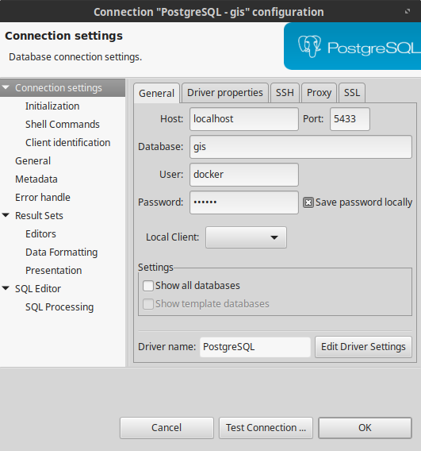

These are instructions for creating a PostGIS server in Docker. They should work pretty much the same on Windows, Mac, or Linux.

# Preparation

It is assumed that you already have Docker installed and have an account on Docker Hub.

If not,

1. [Get Docker](https://docs.docker.com/get-docker/) as appropriate for your OS.
2. [Register](https://hub.docker.com/signup) on Docker Hub.

> **NOTE:** When you first run Docker Desktop, you may get a notice that WSL (Windows Subsystem for Linux) needs to be upgraded. Open Windows PowerShell and run `wsl.exe --update` at the command line.

# Create a PostGIS Container

We will use the PostGIS images maintained at <https://hub.docker.com/r/kartoza/postgis/>. Begin by opening a terminal. Remember that you can use the up and down arrows in the terminal to cycle through recently used commands. If you are working on Windows, I recommend using Windows PowerShell instead of Command Prompt because PowerShell will remember your commands from previous terminal sessions.

Each step is explained below, followed by a command. You should type or paste each command into the terminal and hit Enter after each one.

First, copy the latest PostGIS container image from Docker Hub (this requires an internet connection):

```sh
docker pull kartoza/postgis:latest
```

Note that the `:latest` tag is not strictly necessary. If you leave it off, the latest version will be pulled. However, `latest` has sometimes been quite old. In some semesters, I may instruct you to replace `latest` with a specific version number.

Create the docker image:

```sh
docker create --name my_postgis -p 5433:5432 -e POSTGRES_PASS=docker kartoza/postgis:latest
```

Some remarks:

* `--name my_postgis`: The name my_postgis is arbitrary. You can use another name for the container.
* `-p 5433:5432`: The PostgreSQL server must listen on a specific port for client connections. `5432` is the default Postgres port. If you are already running a native Postgres server on the same machine, `5432` is probably already in use. The `5433` port on `localhost` is mapped to port `5432` (the usual Postgres port) in the container.
* `-e POSTGRES_PASS=docker`: This sets the Postgres password for the `docker` user to `docker`. Note that the Kartoza container documentation is inconsistent on this. It says that the password should automatically be `docker`, but also says that it is generated randomly if omitted. In practice, I found that `docker` did not work *and* the randomly generated password in the Docker logs also did not work, so we are setting the password explicitly.
* `kartoza/postgis:latest` is the name of the container image we previously pulled. Note that if you don't pull the image first, it will be downloaded when you run docker create. If you leave off the tag, it will pull the image with the `latest` tag anyway. In semesters where I instruct you to pull a specific version, make sure to use the version tag here as well.

Now that the container has been created and named, starting it is easy:

```sh
docker start my_postgis
```

The container can also be stopped, and should be stopped before you shut down your computer. It is OK to leave the container running if you suspend or hibernate the computer.

```sh
docker stop my_postgis
```

At any time thereafter, you can start the container back up by running `docker start my_postgis` again.

The container can be removed with:

```sh
docker rm my_postgis
```

Note that for this course, you probably don't want to remove your container, unless you have done something to completely bork it and want to start fresh.

# Connect to the Docker Image in DBeaver

You can now connect to this database using any Postgres client. The image has a PostGIS-enabled database named `gis`, and has been configured with a login role (user) named `docker` and a password `docker` The connection settings for any Postgres client are therefore:

* Host: localhost
* Port: 5433
* Database: gis
* User: docker
* Password: docker

In this course, we will be using DBeaver for database management and querying. The settings in the DBeaver connection settings dialog look like this:



Later in the course, we will also be connecting to this database using QGIS, which has a similar connection dialog.

# References

* <https://hub.docker.com/r/kartoza/postgis/>
* [Set Up a PostGIS Database With Docker](https://alexurquhart.com/post/set-up-postgis-with-docker/) – Note, however, that the author is using Docker Toolbox, not Docker for Windows, and has started the container with a number of environment variables that we are not using.
* [Docker Documentation](https://docs.docker.com/)
    * [docker (base command)](https://docs.docker.com/engine/reference/commandline/docker/)

