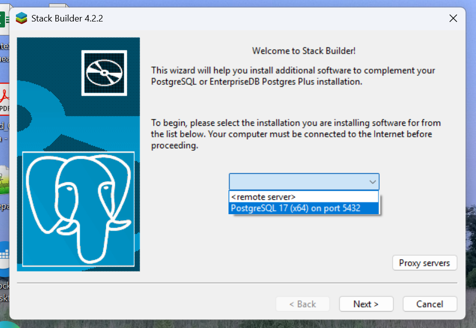
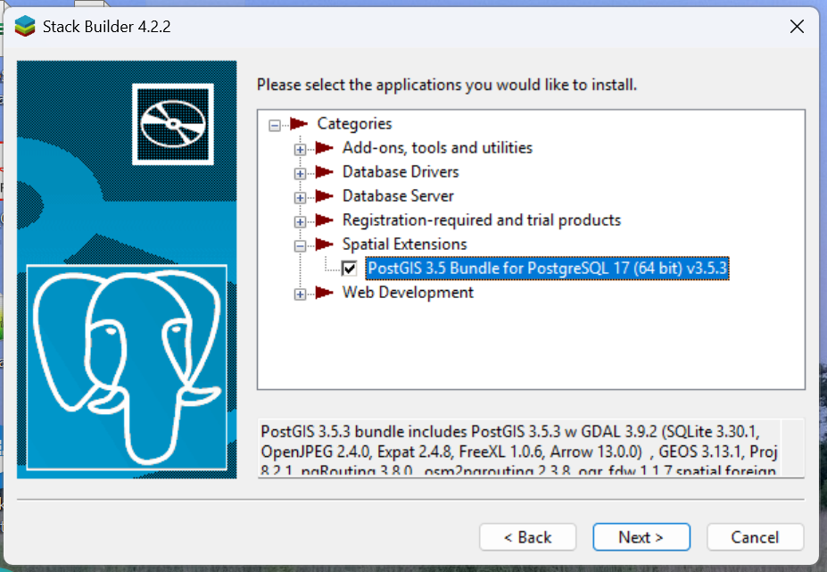
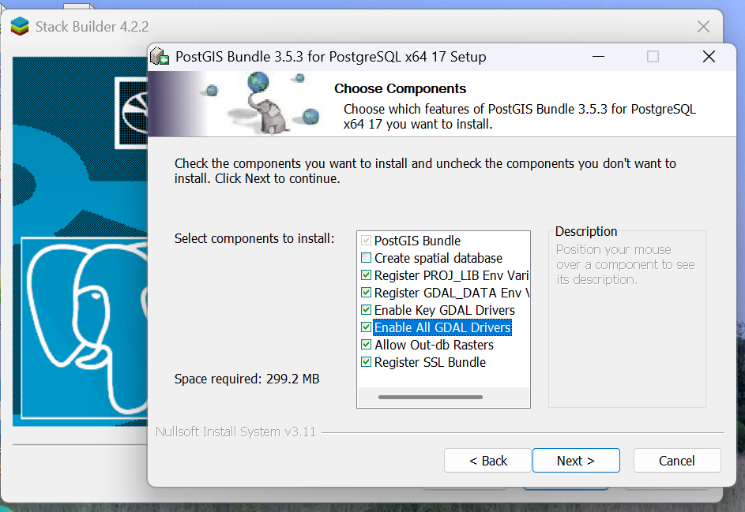
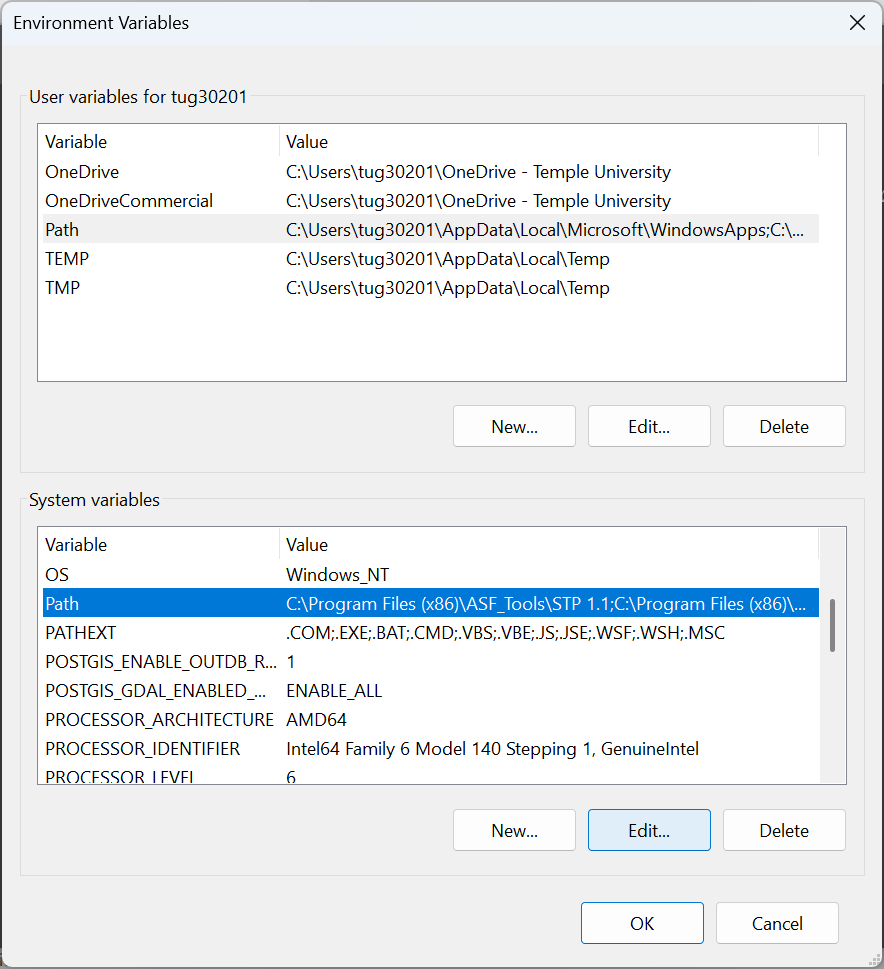
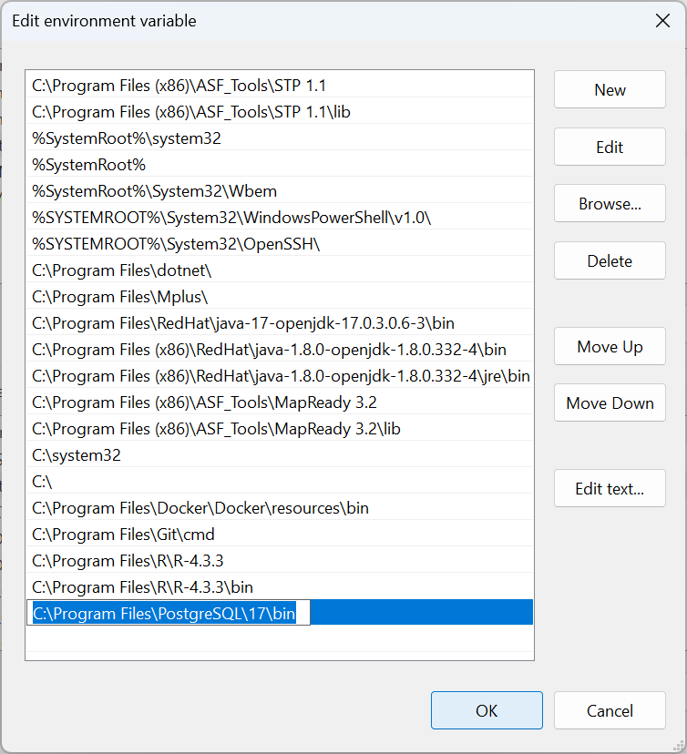

# Installing PostGIS with EnterpriseDB

These instructions are for installing PostgreSQL (and PostGIS) natively on Windows. Installers for both Windows and Mac are available at <https://www.enterprisedb.com/downloads/postgres-postgresql-downloads>. For Fall 2025, you should download PostgreSQL version 17.

> I have not provided instructions for Mac. You should be able to install as you would any other Mac software. When you run StackBuilder to add PostGIS tools, you should be able to follow the instructions (with screenshots) below. I may need to look at your machine to help you find `raster2pgsql` and other PostGIS utilities mentioned below.

# Why Are We Doing This?

I have elsewhere given you [instructions for running PostGIS in a Docker container](creating_a_postgis_server_in_docker.md). These instructions represent an alternative way of installing PostgreSQL/PostGIS. Why are we doing this?

The EnterpriseDB installer comes with some useful tools including pgAdmin 4 (a management client like DBeaver) and command line tools like `psql`. In fact, you can install those *without* installing PostgreSQL.

However, PostGIS ships with a number of small utilites, like `raster2pgsql` for uploading rasters to a PostGIS database and `osm2pgrouting` for uploading OpenStreetMap extracts to pgRouting tables, that are just not available as separate downloads for Windows. So in order to get those, we (a) need to do a full Postgres installation, and (b) need to also install PostGIS. It's a bit of overkill, but in the end it is easier than trying to track down and separately compile or install single-purpose utilities.

Finally, if any of your run into problems getting the Docker container to work, you can install PostGIS this way instead. (I have done this in previous semesters, but found the Docker instructions to be more straightforward, and also want to give you experience using Docker containers, considering how important Docker has become in the data science world.)

# Install PostgreSQL

Full instructions with screenshots are available as part of the EDB docs at <https://www.enterprisedb.com/docs/epas/14/installing/windows/installing_advanced_server_with_the_interactive_installer/performing_a_graphical_installation_on_windows/>. The installer is pretty straightforward, so you probably don't need to refer to those instructions. I provide some instructions specific to our class here:

1. The default installation directory will be `C:\Program Files\PostgreSQL\17`. You should probably leave this alone *but if you change it, you must remember where you installed it, as this is where the command line tools will be installed*.
2. Select all components (should be the default) when prompted.
3. The database superuser will default to `postgres`, and you will be prompted for a password. For this course, use `postgres` as the password as well. ***This is not secure!*** However, we are installing this for learning purposes, and remembering the password is more important that security. Obviously, you should not do this on a production server.
4. The port will default to 5432. You should leave this as is. You may remember that when we set up the Docker container we used port 5433. The reason I had you do this is that if you ever wanted to install Postgres natively on the host operating system, I wanted to keep the default port (5432) available. We are using it now.

When installation completes, you can choose to run StackBuilder at exit. If you don't, you can select StackBuilder from the Start Menu.

# Install Spatial Extentions

Start StackBuilder from the Start Menu (or choose to run it at exit when Postgres installation completes).

On the welcome screen, choose the Postgres installation to add additional capabilities. If you just installed Postgres, there should be only one option in the dropdown. Select it and hit Next.

On the next screen, expand the Spatial Extensions dropdown and choose "PostGIS <version> Bundle...". Hit Next.

Hit Next until you get to the Choose Components screen. Select "Enable All GDAL Drivers". Note that by default, "Create spatial database" is unchecked. You can leave it unchecked, as we are using the database running in a Docker container. If you choose to, you can create another (Windows-native) database here, in which case you will be prompted for a database name.

Continue to hit Next until you get to the final screen, and hit Finish.

# Editing your System Path

This step is necessary so that you can run command line tools like `psql` and `raster2pgsql` without providing an absolute path.

1. Go to the Start Menu and begin typing "environment". Select "Edit the system environment variables". Hit Yes to indicate you want to allow this app to make changes to the device.
2. In the System Properties dialog, click the Environment Variables button (lower right).
3. In the list of system variables, select "Path" and hit the Edit button:\
    
4. In the Edit environment variable dialog, hit New (or just select the first blank line in the list) and paste in `C:\Program Files\PostgreSQL\17\bin`. (Note, if you install Postgres to a different location, or install a different version, your path will be different.)\
    
5. Hit OK three times to exit the Control Panel.

You can check that the path is set correctly by starting Windows Terminal and entering `psql --version`. This will just print the version number of the `psql` utility. If you get a message like `psql: The term 'psql' is not recognized...`, then you haven't set the path correctly. Note that if Windows Terminal was already open when you added the new path, you will have to restart Windows Terminal.

